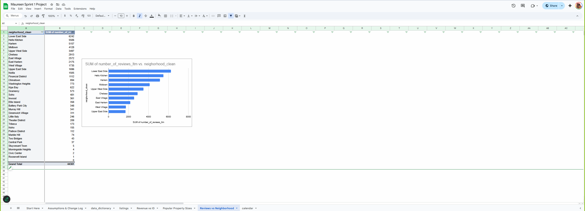

# NYC Airbnb Project  

## 📌 Project Overview  
This project analyzes Airbnb data for the Manhattan vacation rental market to help a client determine:  
- Which **neighborhoods** are most attractive for vacation rentals  
- Which **property sizes** (number of bedrooms) are most popular  
- How much **revenue** these listings generate  

The goal is to provide **investment recommendations** based on insights from property size trends, neighborhood popularity, and revenue performance.  
Project uses GoogleSheets as the tool for analysis.

---

## Analysis
<a href="https://github.com/mwirtz2020/TripleTen-Data-Projects/blob/main/NYC%20Airbnb%20Project%201/NYC%20Airbnb%20Project%20Analysis.pdf" > Analysis Document </a> 

The Manhattan vacation rental market analysis revealed that 1-bedroom properties are the most popular among Airbnb listings, suggesting strong demand from solo travelers and couples. Lower East Side, Hell’s Kitchen, and Harlem emerged as the neighborhoods with the highest number of reviews, indicating consistent guest interest and engagement. Revenue analysis showed that the top-earning listing generated $29,940 per month, providing a benchmark for potential high-performing investments. By combining insights from property size, neighborhood popularity, and revenue, investors can make informed decisions on which properties to acquire. Overall, the data suggests that focusing on 1-bedroom units in high-demand neighborhoods with competitive amenities can maximize both occupancy and revenue.

---

## 📊 Conclusions  

1. **Popular Property Size**  
   - The most popular property type is **1-bedroom rentals**, indicating strong demand from solo travelers and couples.  

2. **Top Neighborhoods (by reviews)**  
   - **Lower East Side**  
   - **Hell’s Kitchen**  
   - **Harlem**  
   These neighborhoods attract high guest engagement and booking activity.  

3. **Revenue Insights**  
   - The **highest-earning listing (ID: 49946551)** generated approximately **$29,940 per month**, serving as a benchmark for top-tier performance.  

---

## 💡 Recommendations  

- **Invest in 1-bedroom properties** for consistent demand.  
- **Target high-traffic neighborhoods** such as Lower East Side, Hell’s Kitchen, and Harlem.  
- **Benchmark against top listings** to replicate success factors (e.g., amenities, pricing strategy, location).  
- **Differentiate offerings** through modern amenities, remote-work readiness, and unique guest experiences.  
- **Monitor regulatory changes** in New York City to ensure compliance with evolving short-term rental laws.  
